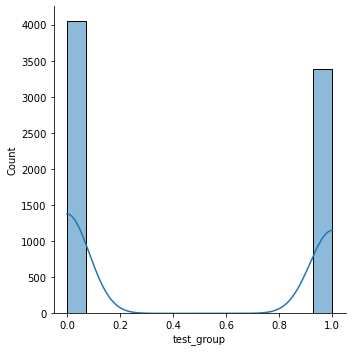
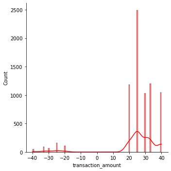
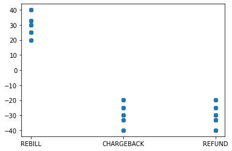

```python
#Observation from the below analysis are as follows:

#1.Probability distribution between test groups is Bernoulli Distribution,charts are as shown.
#2Test group users(call-in) are less likely (52.6%) to have at least 1 additional REBILL than control group users(webform)(73.6%)
#3.Webform/control group users generate more revenue than web-form users.
#4.Charge back rate of call-in users (0.017) is slightly less that web-form users(0.028)
```


```python
#importing necessary libraries.
import pandas as pd
import numpy as np
import matplotlib.pyplot as plt
import seaborn as sns
import scipy.stats as stats
```


```python
#uploading the data
path="E:/transData.csv"
df_trans=pd.read_csv(path)
```


```python
path="E:/testSamples.csv"
df_test=pd.read_csv(path)
```


```python
#understanding the data
df_trans.head(5)
```


<div>
<style scoped>
    .dataframe tbody tr th:only-of-type {
        vertical-align: middle;
    }

    .dataframe tbody tr th {
        vertical-align: top;
    }

    .dataframe thead th {
        text-align: right;
    }
</style>
<table border="1" class="dataframe">
  <thead>
    <tr style="text-align: right;">
      <th></th>
      <th>transaction_id</th>
      <th>sample_id</th>
      <th>transaction_type</th>
      <th>transaction_amount</th>
    </tr>
  </thead>
  <tbody>
    <tr>
      <th>0</th>
      <td>52346326</td>
      <td>11</td>
      <td>REBILL</td>
      <td>24.95</td>
    </tr>
    <tr>
      <th>1</th>
      <td>52346327</td>
      <td>11</td>
      <td>REBILL</td>
      <td>24.95</td>
    </tr>
    <tr>
      <th>2</th>
      <td>52346328</td>
      <td>32</td>
      <td>REBILL</td>
      <td>29.95</td>
    </tr>
    <tr>
      <th>3</th>
      <td>52346329</td>
      <td>32</td>
      <td>REBILL</td>
      <td>29.95</td>
    </tr>
    <tr>
      <th>4</th>
      <td>52346330</td>
      <td>32</td>
      <td>REBILL</td>
      <td>29.95</td>
    </tr>
  </tbody>
</table>
</div>


```python
df_test.head(5)
```


<div>
<style scoped>
    .dataframe tbody tr th:only-of-type {
        vertical-align: middle;
    }

    .dataframe tbody tr th {
        vertical-align: top;
    }

    .dataframe thead th {
        text-align: right;
    }
</style>
<table border="1" class="dataframe">
  <thead>
    <tr style="text-align: right;">
      <th></th>
      <th>sample_id</th>
      <th>test_group</th>
    </tr>
  </thead>
  <tbody>
    <tr>
      <th>0</th>
      <td>1</td>
      <td>0</td>
    </tr>
    <tr>
      <th>1</th>
      <td>2</td>
      <td>1</td>
    </tr>
    <tr>
      <th>2</th>
      <td>3</td>
      <td>0</td>
    </tr>
    <tr>
      <th>3</th>
      <td>4</td>
      <td>1</td>
    </tr>
    <tr>
      <th>4</th>
      <td>5</td>
      <td>1</td>
    </tr>
  </tbody>
</table>
</div>


```python
df_trans.describe(include="all")
#no outliers observed
```


<div>
<style scoped>
    .dataframe tbody tr th:only-of-type {
        vertical-align: middle;
    }

    .dataframe tbody tr th {
        vertical-align: top;
    }

    .dataframe thead th {
        text-align: right;
    }
</style>
<table border="1" class="dataframe">
  <thead>
    <tr style="text-align: right;">
      <th></th>
      <th>transaction_id</th>
      <th>sample_id</th>
      <th>transaction_type</th>
      <th>transaction_amount</th>
    </tr>
  </thead>
  <tbody>
    <tr>
      <th>count</th>
      <td>7.430000e+03</td>
      <td>7430.000000</td>
      <td>7430</td>
      <td>7430.000000</td>
    </tr>
    <tr>
      <th>unique</th>
      <td>NaN</td>
      <td>NaN</td>
      <td>3</td>
      <td>NaN</td>
    </tr>
    <tr>
      <th>top</th>
      <td>NaN</td>
      <td>NaN</td>
      <td>REBILL</td>
      <td>NaN</td>
    </tr>
    <tr>
      <th>freq</th>
      <td>NaN</td>
      <td>NaN</td>
      <td>6961</td>
      <td>NaN</td>
    </tr>
    <tr>
      <th>mean</th>
      <td>5.235004e+07</td>
      <td>30245.874024</td>
      <td>NaN</td>
      <td>24.935720</td>
    </tr>
    <tr>
      <th>std</th>
      <td>2.145001e+03</td>
      <td>17064.733330</td>
      <td>NaN</td>
      <td>15.050653</td>
    </tr>
    <tr>
      <th>min</th>
      <td>5.234633e+07</td>
      <td>11.000000</td>
      <td>NaN</td>
      <td>-39.950000</td>
    </tr>
    <tr>
      <th>25%</th>
      <td>5.234818e+07</td>
      <td>15866.250000</td>
      <td>NaN</td>
      <td>24.950000</td>
    </tr>
    <tr>
      <th>50%</th>
      <td>5.235004e+07</td>
      <td>30557.000000</td>
      <td>NaN</td>
      <td>24.950000</td>
    </tr>
    <tr>
      <th>75%</th>
      <td>5.235190e+07</td>
      <td>44945.000000</td>
      <td>NaN</td>
      <td>32.950000</td>
    </tr>
    <tr>
      <th>max</th>
      <td>5.235376e+07</td>
      <td>59694.000000</td>
      <td>NaN</td>
      <td>39.950000</td>
    </tr>
  </tbody>
</table>
</div>


```python
#understanding the data
df_test.describe(include="all")
```


<div>
<style scoped>
    .dataframe tbody tr th:only-of-type {
        vertical-align: middle;
    }

    .dataframe tbody tr th {
        vertical-align: top;
    }

    .dataframe thead th {
        text-align: right;
    }
</style>
<table border="1" class="dataframe">
  <thead>
    <tr style="text-align: right;">
      <th></th>
      <th>sample_id</th>
      <th>test_group</th>
    </tr>
  </thead>
  <tbody>
    <tr>
      <th>count</th>
      <td>59721.00000</td>
      <td>59721.000000</td>
    </tr>
    <tr>
      <th>mean</th>
      <td>29861.00000</td>
      <td>0.248405</td>
    </tr>
    <tr>
      <th>std</th>
      <td>17240.11205</td>
      <td>0.432092</td>
    </tr>
    <tr>
      <th>min</th>
      <td>1.00000</td>
      <td>0.000000</td>
    </tr>
    <tr>
      <th>25%</th>
      <td>14931.00000</td>
      <td>0.000000</td>
    </tr>
    <tr>
      <th>50%</th>
      <td>29861.00000</td>
      <td>0.000000</td>
    </tr>
    <tr>
      <th>75%</th>
      <td>44791.00000</td>
      <td>0.000000</td>
    </tr>
    <tr>
      <th>max</th>
      <td>59721.00000</td>
      <td>1.000000</td>
    </tr>
  </tbody>
</table>
</div>


```python
#joining the data sets into one data frame
df = pd.merge(df_trans, df_test)
```


```python
#checking for NUlL values if any
df.isnull()
```


<div>
<style scoped>
    .dataframe tbody tr th:only-of-type {
        vertical-align: middle;
    }

    .dataframe tbody tr th {
        vertical-align: top;
    }

    .dataframe thead th {
        text-align: right;
    }
</style>
<table border="1" class="dataframe">
  <thead>
    <tr style="text-align: right;">
      <th></th>
      <th>transaction_id</th>
      <th>sample_id</th>
      <th>transaction_type</th>
      <th>transaction_amount</th>
      <th>test_group</th>
    </tr>
  </thead>
  <tbody>
    <tr>
      <th>0</th>
      <td>False</td>
      <td>False</td>
      <td>False</td>
      <td>False</td>
      <td>False</td>
    </tr>
    <tr>
      <th>1</th>
      <td>False</td>
      <td>False</td>
      <td>False</td>
      <td>False</td>
      <td>False</td>
    </tr>
    <tr>
      <th>2</th>
      <td>False</td>
      <td>False</td>
      <td>False</td>
      <td>False</td>
      <td>False</td>
    </tr>
    <tr>
      <th>3</th>
      <td>False</td>
      <td>False</td>
      <td>False</td>
      <td>False</td>
      <td>False</td>
    </tr>
    <tr>
      <th>4</th>
      <td>False</td>
      <td>False</td>
      <td>False</td>
      <td>False</td>
      <td>False</td>
    </tr>
    <tr>
      <th>...</th>
      <td>...</td>
      <td>...</td>
      <td>...</td>
      <td>...</td>
      <td>...</td>
    </tr>
    <tr>
      <th>7425</th>
      <td>False</td>
      <td>False</td>
      <td>False</td>
      <td>False</td>
      <td>False</td>
    </tr>
    <tr>
      <th>7426</th>
      <td>False</td>
      <td>False</td>
      <td>False</td>
      <td>False</td>
      <td>False</td>
    </tr>
    <tr>
      <th>7427</th>
      <td>False</td>
      <td>False</td>
      <td>False</td>
      <td>False</td>
      <td>False</td>
    </tr>
    <tr>
      <th>7428</th>
      <td>False</td>
      <td>False</td>
      <td>False</td>
      <td>False</td>
      <td>False</td>
    </tr>
    <tr>
      <th>7429</th>
      <td>False</td>
      <td>False</td>
      <td>False</td>
      <td>False</td>
      <td>False</td>
    </tr>
  </tbody>
</table>
<p>7430 rows × 5 columns</p>
</div>


```python
df.head(5)
```


<div>
<style scoped>
    .dataframe tbody tr th:only-of-type {
        vertical-align: middle;
    }

    .dataframe tbody tr th {
        vertical-align: top;
    }

    .dataframe thead th {
        text-align: right;
    }
</style>
<table border="1" class="dataframe">
  <thead>
    <tr style="text-align: right;">
      <th></th>
      <th>transaction_id</th>
      <th>sample_id</th>
      <th>transaction_type</th>
      <th>transaction_amount</th>
      <th>test_group</th>
    </tr>
  </thead>
  <tbody>
    <tr>
      <th>0</th>
      <td>52346326</td>
      <td>11</td>
      <td>REBILL</td>
      <td>24.95</td>
      <td>1</td>
    </tr>
    <tr>
      <th>1</th>
      <td>52346327</td>
      <td>11</td>
      <td>REBILL</td>
      <td>24.95</td>
      <td>1</td>
    </tr>
    <tr>
      <th>2</th>
      <td>52346328</td>
      <td>32</td>
      <td>REBILL</td>
      <td>29.95</td>
      <td>1</td>
    </tr>
    <tr>
      <th>3</th>
      <td>52346329</td>
      <td>32</td>
      <td>REBILL</td>
      <td>29.95</td>
      <td>1</td>
    </tr>
    <tr>
      <th>4</th>
      <td>52346330</td>
      <td>32</td>
      <td>REBILL</td>
      <td>29.95</td>
      <td>1</td>
    </tr>
  </tbody>
</table>
</div>


```python
## First analysis : What is the aproximate probability distribution between the test group and the control group ##
```


```python
from scipy.stats import bernoulli
def bernoulliDist():
    bernoulli_data = df['test_group']
    sns.displot(bernoulli_data,  kde = True,)

bernoulliDist()
```


    

    


```python
#Probability distribution between test groups is Bernoulli Distribution,charts are as shown.
```


```python
# SECOND ANALYSIS:Is a user that must call-in to cancel more likely to generate at least 1 addition REBILL  
```


```python
#filtering the data for control group for rebill
df_control_group = df[(df.test_group == 0) & (df.transaction_type=='REBILL')]
df_control_group
```


<div>
<style scoped>
    .dataframe tbody tr th:only-of-type {
        vertical-align: middle;
    }

    .dataframe tbody tr th {
        vertical-align: top;
    }

    .dataframe thead th {
        text-align: right;
    }
</style>
<table border="1" class="dataframe">
  <thead>
    <tr style="text-align: right;">
      <th></th>
      <th>transaction_id</th>
      <th>sample_id</th>
      <th>transaction_type</th>
      <th>transaction_amount</th>
      <th>test_group</th>
    </tr>
  </thead>
  <tbody>
    <tr>
      <th>6</th>
      <td>52346332</td>
      <td>103</td>
      <td>REBILL</td>
      <td>19.95</td>
      <td>0</td>
    </tr>
    <tr>
      <th>7</th>
      <td>52346333</td>
      <td>103</td>
      <td>REBILL</td>
      <td>19.95</td>
      <td>0</td>
    </tr>
    <tr>
      <th>8</th>
      <td>52346334</td>
      <td>103</td>
      <td>REBILL</td>
      <td>19.95</td>
      <td>0</td>
    </tr>
    <tr>
      <th>9</th>
      <td>52346335</td>
      <td>103</td>
      <td>REBILL</td>
      <td>19.95</td>
      <td>0</td>
    </tr>
    <tr>
      <th>10</th>
      <td>52346336</td>
      <td>103</td>
      <td>REBILL</td>
      <td>19.95</td>
      <td>0</td>
    </tr>
    <tr>
      <th>...</th>
      <td>...</td>
      <td>...</td>
      <td>...</td>
      <td>...</td>
      <td>...</td>
    </tr>
    <tr>
      <th>7417</th>
      <td>52353743</td>
      <td>59573</td>
      <td>REBILL</td>
      <td>24.95</td>
      <td>0</td>
    </tr>
    <tr>
      <th>7418</th>
      <td>52353744</td>
      <td>59573</td>
      <td>REBILL</td>
      <td>24.95</td>
      <td>0</td>
    </tr>
    <tr>
      <th>7419</th>
      <td>52353745</td>
      <td>59573</td>
      <td>REBILL</td>
      <td>24.95</td>
      <td>0</td>
    </tr>
    <tr>
      <th>7427</th>
      <td>52353753</td>
      <td>59689</td>
      <td>REBILL</td>
      <td>24.95</td>
      <td>0</td>
    </tr>
    <tr>
      <th>7428</th>
      <td>52353754</td>
      <td>59689</td>
      <td>REBILL</td>
      <td>24.95</td>
      <td>0</td>
    </tr>
  </tbody>
</table>
<p>3756 rows × 5 columns</p>
</div>


```python
Total_control_group_samples=df_control_group.groupby(['sample_id'])['transaction_type'].count()
Total_control_group_samples
```


    sample_id
    103      11
    109       1
    127       2
    135       3
    364       2
             ..
    59419     4
    59507     5
    59570     2
    59573     3
    59689     2
    Name: transaction_type, Length: 941, dtype: int64


```python
#Grouping the control group/ web form user id that have atleast 1 addition REBILL
control_group_atleast1_Rebill=df_control_group.groupby(['sample_id'])['transaction_type'].count().pipe(lambda  transaction_type: transaction_type.loc[transaction_type>1])
control_group_atleast1_Rebill
```


    sample_id
    103      11
    127       2
    135       3
    364       2
    426       4
             ..
    59419     4
    59507     5
    59570     2
    59573     3
    59689     2
    Name: transaction_type, Length: 693, dtype: int64


```python
count_control_group_atleast1_Rebill=control_group_atleast1_Rebill.count()
count_control_group_atleast1_Rebill
```


    693


```python
count_Total_control_group_samples=Total_control_group_samples.count()
count_Total_control_group_samples
```


    941


```python
percentage_control_group = count_control_group_atleast1_Rebill / count_Total_control_group_samples*100
percentage_control_group
```


    73.64505844845908


```python
#CONCLUSION FROM ABOVE:
#Total control group samples with REBILL=940
#Number of control group samples with atleast 1 REBILL = 693
#%. of control group sample with atleast 1 REBILL =73.6%
```


```python
#filtering the data for test group for rebill
df_test_group = df[(df.test_group == 1) & (df.transaction_type=='REBILL')]
```


```python
Total_test_group_samples=df_test_group.groupby(['sample_id'])['transaction_type'].count()
Total_test_group_samples
```


    sample_id
    11       2
    32       4
    137      2
    138      1
    249      1
            ..
    59560    1
    59581    2
    59628    2
    59654    2
    59694    1
    Name: transaction_type, Length: 1556, dtype: int64


```python
#Grouping the test group/ Call-in user id that have atleast 1 addition REBILL
test_group_atleast1_Rebill=df_test_group.groupby(['sample_id'])['transaction_type'].count().pipe(lambda  transaction_type: transaction_type.loc[transaction_type>1])
test_group_atleast1_Rebill
```


    sample_id
    11       2
    32       4
    137      2
    261      2
    295      2
            ..
    59407    3
    59484    4
    59581    2
    59628    2
    59654    2
    Name: transaction_type, Length: 819, dtype: int64


```python
count_test_group_atleast1_Rebill=test_group_atleast1_Rebill.count()
count_test_group_atleast1_Rebill
```


    819


```python
count_Total_test_group_samples=Total_test_group_samples.count()
count_Total_test_group_samples
```


    1556


```python
percentage_test_group = count_test_group_atleast1_Rebill / count_Total_test_group_samples*100
percentage_test_group
```


    52.63496143958869


```python
#CONCLUSION FROM ABOVE:
#Total test group samples with REBILL=1556
#Number of test group samples with atleast 1 REBILL = 819
#%. of test group sample with atleast 1 REBILL =53.6%
```


```python
########################  THIRD ANALYSIS (Part-1) : Revenue of test groups without considering CHARGEBACK & REFUNDS   ####
```


```python
#Calculating the net revenue of control group(0)
```


```python
#average_revenue_per_user_of_control_group
```


```python
revenue_control_group = df_control_group['transaction_amount'].sum()
revenue_control_group
```


    97359.19999999997


```python
average_revenue_per_user_of_control_group = revenue_control_group/count_Total_control_group_samples
average_revenue_per_user_of_control_group
```


    103.46354941551537


```python
#average_revenue_per_user_of_test_group 
```


```python
revenue_test_group = df_test_group['transaction_amount'].sum()
revenue_test_group
```


    100869.74999999997


```python
average_revenue_per_user_of_test_group = revenue_test_group/count_Total_test_group_samples
average_revenue_per_user_of_test_group
```


    64.82631748071978


```python
#average_revenue_per_user_of_control_group = 103.46
#average_revenue_per_user_of_test_group = 64.82
```


```python
########################  THIRD ANALYSIS (Part-2) : Revenue of test groups considering CHARGEBACK & REFUNDS ########
```


```python
#Finding gross revenue of control group after adjusting the neagative transations
```


```python
df_control_group_chargeback = df[(df.test_group == 0) & (df.transaction_type=='CHARGEBACK')]
```


```python
#finding the control group users that have rebilled as well raised chargeback
control_group_rebill_Chargeback =  set(df_control_group['sample_id']).intersection(df_control_group_chargeback['sample_id']) 
control_group_rebill_Chargeback
```


    {18430, 24982}


```python
df_control_group_refund = df[(df.test_group == 0) & (df.transaction_type=='REFUND')]
```


```python
#finding the control group users that have rebilled as well raised refund
control_group_rebill_refund =  set(df_control_group['sample_id']).intersection(df_control_group_refund['sample_id']) 
control_group_rebill_refund
```


    {24796}


```python
# Get rows with set of chargeback values of control group(0)

chargeback_transaction_control_group= df_control_group_chargeback.loc[df_control_group_chargeback['sample_id'].isin([24982, 18430])]
chargeback_transaction_control_group
```


<div>
<style scoped>
    .dataframe tbody tr th:only-of-type {
        vertical-align: middle;
    }

    .dataframe tbody tr th {
        vertical-align: top;
    }

    .dataframe thead th {
        text-align: right;
    }
</style>
<table border="1" class="dataframe">
  <thead>
    <tr style="text-align: right;">
      <th></th>
      <th>transaction_id</th>
      <th>sample_id</th>
      <th>transaction_type</th>
      <th>transaction_amount</th>
      <th>test_group</th>
    </tr>
  </thead>
  <tbody>
    <tr>
      <th>2220</th>
      <td>52348546</td>
      <td>18430</td>
      <td>CHARGEBACK</td>
      <td>-24.95</td>
      <td>0</td>
    </tr>
    <tr>
      <th>2221</th>
      <td>52348547</td>
      <td>18430</td>
      <td>CHARGEBACK</td>
      <td>-24.95</td>
      <td>0</td>
    </tr>
    <tr>
      <th>3063</th>
      <td>52349389</td>
      <td>24982</td>
      <td>CHARGEBACK</td>
      <td>-32.95</td>
      <td>0</td>
    </tr>
  </tbody>
</table>
</div>


```python
# Get rows with set of refund values of control group(0)

refund_transaction_control_group= df_control_group_refund.loc[df_control_group_refund['sample_id'].isin([24796])]
refund_transaction_control_group
```


<div>
<style scoped>
    .dataframe tbody tr th:only-of-type {
        vertical-align: middle;
    }

    .dataframe tbody tr th {
        vertical-align: top;
    }

    .dataframe thead th {
        text-align: right;
    }
</style>
<table border="1" class="dataframe">
  <thead>
    <tr style="text-align: right;">
      <th></th>
      <th>transaction_id</th>
      <th>sample_id</th>
      <th>transaction_type</th>
      <th>transaction_amount</th>
      <th>test_group</th>
    </tr>
  </thead>
  <tbody>
    <tr>
      <th>3023</th>
      <td>52349349</td>
      <td>24796</td>
      <td>REFUND</td>
      <td>-19.95</td>
      <td>0</td>
    </tr>
  </tbody>
</table>
</div>


```python
#concatanating the two data frames of control group to find negative revenue
negative_revenue_control_group = pd.concat([chargeback_transaction_control_group, refund_transaction_control_group],                  # Append DataFrames
                      ignore_index = True,
                      sort = False)
negative_revenue_control_group
```


<div>
<style scoped>
    .dataframe tbody tr th:only-of-type {
        vertical-align: middle;
    }

    .dataframe tbody tr th {
        vertical-align: top;
    }

    .dataframe thead th {
        text-align: right;
    }
</style>
<table border="1" class="dataframe">
  <thead>
    <tr style="text-align: right;">
      <th></th>
      <th>transaction_id</th>
      <th>sample_id</th>
      <th>transaction_type</th>
      <th>transaction_amount</th>
      <th>test_group</th>
    </tr>
  </thead>
  <tbody>
    <tr>
      <th>0</th>
      <td>52348546</td>
      <td>18430</td>
      <td>CHARGEBACK</td>
      <td>-24.95</td>
      <td>0</td>
    </tr>
    <tr>
      <th>1</th>
      <td>52348547</td>
      <td>18430</td>
      <td>CHARGEBACK</td>
      <td>-24.95</td>
      <td>0</td>
    </tr>
    <tr>
      <th>2</th>
      <td>52349389</td>
      <td>24982</td>
      <td>CHARGEBACK</td>
      <td>-32.95</td>
      <td>0</td>
    </tr>
    <tr>
      <th>3</th>
      <td>52349349</td>
      <td>24796</td>
      <td>REFUND</td>
      <td>-19.95</td>
      <td>0</td>
    </tr>
  </tbody>
</table>
</div>


```python
#finding absolute value of negative transactions(chargeback and refund) control group.
negative_transactions_control_group = (np.abs(sum(negative_revenue_control_group.transaction_amount)))
negative_transactions_control_group
```


    102.8


```python
gross_revenue_control_group= revenue_control_group - negative_transactions_control_group
gross_revenue_control_group
```


    97256.39999999997


```python
average_gross_revenue_per_user_of_control_group = gross_revenue_control_group/count_Total_control_group_samples
average_gross_revenue_per_user_of_control_group
```


    103.3543039319872


```python
#Finding gross revenue of test group after adjusting the neagative transations
```


```python
df_test_group_chargeback = df[(df.test_group == 1) & (df.transaction_type=='CHARGEBACK')]
```


```python
#finding the test group users that have rebilled as well raised chargeback
test_group_rebill_Chargeback =  set(df_test_group['sample_id']).intersection(df_test_group_chargeback['sample_id']) 
test_group_rebill_Chargeback
```


    {7338, 15909, 17305, 29386, 35733, 35914}


```python
df_test_group_refund = df[(df.test_group == 1) & (df.transaction_type=='REFUND')]
```


```python
#finding the test group users that have rebilled as well raised refund
test_group_rebill_refund =  set(df_test_group['sample_id']).intersection(df_test_group_refund['sample_id']) 
test_group_rebill_refund
```


    {25114, 36640}


```python
# Get rows with set of chargeback values of test group(1)

chargeback_transaction_test_group= df_test_group_chargeback.loc[df_test_group_chargeback['sample_id'].isin([7338, 15909, 17305, 29386, 35733, 35914])]
chargeback_transaction_test_group
```


<div>
<style scoped>
    .dataframe tbody tr th:only-of-type {
        vertical-align: middle;
    }

    .dataframe tbody tr th {
        vertical-align: top;
    }

    .dataframe thead th {
        text-align: right;
    }
</style>
<table border="1" class="dataframe">
  <thead>
    <tr style="text-align: right;">
      <th></th>
      <th>transaction_id</th>
      <th>sample_id</th>
      <th>transaction_type</th>
      <th>transaction_amount</th>
      <th>test_group</th>
    </tr>
  </thead>
  <tbody>
    <tr>
      <th>870</th>
      <td>52347196</td>
      <td>7338</td>
      <td>CHARGEBACK</td>
      <td>-29.95</td>
      <td>1</td>
    </tr>
    <tr>
      <th>1868</th>
      <td>52348194</td>
      <td>15909</td>
      <td>CHARGEBACK</td>
      <td>-24.95</td>
      <td>1</td>
    </tr>
    <tr>
      <th>2027</th>
      <td>52348353</td>
      <td>17305</td>
      <td>CHARGEBACK</td>
      <td>-24.95</td>
      <td>1</td>
    </tr>
    <tr>
      <th>2028</th>
      <td>52348354</td>
      <td>17305</td>
      <td>CHARGEBACK</td>
      <td>-24.95</td>
      <td>1</td>
    </tr>
    <tr>
      <th>3549</th>
      <td>52349875</td>
      <td>29386</td>
      <td>CHARGEBACK</td>
      <td>-29.95</td>
      <td>1</td>
    </tr>
    <tr>
      <th>4367</th>
      <td>52350693</td>
      <td>35733</td>
      <td>CHARGEBACK</td>
      <td>-24.95</td>
      <td>1</td>
    </tr>
    <tr>
      <th>4381</th>
      <td>52350707</td>
      <td>35914</td>
      <td>CHARGEBACK</td>
      <td>-39.95</td>
      <td>1</td>
    </tr>
    <tr>
      <th>4382</th>
      <td>52350708</td>
      <td>35914</td>
      <td>CHARGEBACK</td>
      <td>-39.95</td>
      <td>1</td>
    </tr>
    <tr>
      <th>4383</th>
      <td>52350709</td>
      <td>35914</td>
      <td>CHARGEBACK</td>
      <td>-39.95</td>
      <td>1</td>
    </tr>
    <tr>
      <th>4384</th>
      <td>52350710</td>
      <td>35914</td>
      <td>CHARGEBACK</td>
      <td>-39.95</td>
      <td>1</td>
    </tr>
  </tbody>
</table>
</div>


```python
# Get rows with set of refund values of test group(1)

refund_transaction_test_group= df_test_group_refund.loc[df_test_group_refund['sample_id'].isin([25114, 36640])]
refund_transaction_test_group
```


<div>
<style scoped>
    .dataframe tbody tr th:only-of-type {
        vertical-align: middle;
    }

    .dataframe tbody tr th {
        vertical-align: top;
    }

    .dataframe thead th {
        text-align: right;
    }
</style>
<table border="1" class="dataframe">
  <thead>
    <tr style="text-align: right;">
      <th></th>
      <th>transaction_id</th>
      <th>sample_id</th>
      <th>transaction_type</th>
      <th>transaction_amount</th>
      <th>test_group</th>
    </tr>
  </thead>
  <tbody>
    <tr>
      <th>3085</th>
      <td>52349411</td>
      <td>25114</td>
      <td>REFUND</td>
      <td>-24.95</td>
      <td>1</td>
    </tr>
    <tr>
      <th>3086</th>
      <td>52349412</td>
      <td>25114</td>
      <td>REFUND</td>
      <td>-24.95</td>
      <td>1</td>
    </tr>
    <tr>
      <th>4481</th>
      <td>52350807</td>
      <td>36640</td>
      <td>REFUND</td>
      <td>-29.95</td>
      <td>1</td>
    </tr>
  </tbody>
</table>
</div>


```python
#concatanating the two data frames of test group to find negative revenue
negative_revenue_test_group = pd.concat([chargeback_transaction_test_group, refund_transaction_test_group],                  # Append DataFrames
                      ignore_index = True,
                      sort = False)
negative_revenue_test_group
```


<div>
<style scoped>
    .dataframe tbody tr th:only-of-type {
        vertical-align: middle;
    }

    .dataframe tbody tr th {
        vertical-align: top;
    }

    .dataframe thead th {
        text-align: right;
    }
</style>
<table border="1" class="dataframe">
  <thead>
    <tr style="text-align: right;">
      <th></th>
      <th>transaction_id</th>
      <th>sample_id</th>
      <th>transaction_type</th>
      <th>transaction_amount</th>
      <th>test_group</th>
    </tr>
  </thead>
  <tbody>
    <tr>
      <th>0</th>
      <td>52347196</td>
      <td>7338</td>
      <td>CHARGEBACK</td>
      <td>-29.95</td>
      <td>1</td>
    </tr>
    <tr>
      <th>1</th>
      <td>52348194</td>
      <td>15909</td>
      <td>CHARGEBACK</td>
      <td>-24.95</td>
      <td>1</td>
    </tr>
    <tr>
      <th>2</th>
      <td>52348353</td>
      <td>17305</td>
      <td>CHARGEBACK</td>
      <td>-24.95</td>
      <td>1</td>
    </tr>
    <tr>
      <th>3</th>
      <td>52348354</td>
      <td>17305</td>
      <td>CHARGEBACK</td>
      <td>-24.95</td>
      <td>1</td>
    </tr>
    <tr>
      <th>4</th>
      <td>52349875</td>
      <td>29386</td>
      <td>CHARGEBACK</td>
      <td>-29.95</td>
      <td>1</td>
    </tr>
    <tr>
      <th>5</th>
      <td>52350693</td>
      <td>35733</td>
      <td>CHARGEBACK</td>
      <td>-24.95</td>
      <td>1</td>
    </tr>
    <tr>
      <th>6</th>
      <td>52350707</td>
      <td>35914</td>
      <td>CHARGEBACK</td>
      <td>-39.95</td>
      <td>1</td>
    </tr>
    <tr>
      <th>7</th>
      <td>52350708</td>
      <td>35914</td>
      <td>CHARGEBACK</td>
      <td>-39.95</td>
      <td>1</td>
    </tr>
    <tr>
      <th>8</th>
      <td>52350709</td>
      <td>35914</td>
      <td>CHARGEBACK</td>
      <td>-39.95</td>
      <td>1</td>
    </tr>
    <tr>
      <th>9</th>
      <td>52350710</td>
      <td>35914</td>
      <td>CHARGEBACK</td>
      <td>-39.95</td>
      <td>1</td>
    </tr>
    <tr>
      <th>10</th>
      <td>52349411</td>
      <td>25114</td>
      <td>REFUND</td>
      <td>-24.95</td>
      <td>1</td>
    </tr>
    <tr>
      <th>11</th>
      <td>52349412</td>
      <td>25114</td>
      <td>REFUND</td>
      <td>-24.95</td>
      <td>1</td>
    </tr>
    <tr>
      <th>12</th>
      <td>52350807</td>
      <td>36640</td>
      <td>REFUND</td>
      <td>-29.95</td>
      <td>1</td>
    </tr>
  </tbody>
</table>
</div>


```python
#finding absolute value of negative transactions(chargeback and refund) test group.
negative_transactions_test_group = (np.abs(sum(negative_revenue_test_group.transaction_amount)))
negative_transactions_test_group
```


    399.3499999999999


```python
gross_revenue_test_group= revenue_test_group - negative_transactions_test_group
gross_revenue_test_group
```


    100470.39999999997


```python
average_gross_revenue_per_user_of_test_group = gross_revenue_test_group/count_Total_test_group_samples
average_gross_revenue_per_user_of_test_group
```


    64.56966580976861


```python
#average_revenue_per_user_of_control_group = 103.35
#average_revenue_per_user_of_test_group = 64.56
```


```python

```


```python
######################## FOURTH ANALYSIS:chargeback rate ######################
#Is a user that must call-in more likely to produce a higher chargeback rate
```


```python
#calculating charge back rate of web form users/control group (0).
df_control_group_chargeback = df[(df.test_group == 0) & (df.transaction_type=='CHARGEBACK')]  #repeat
df_control_group_chargeback
```


<div>
<style scoped>
    .dataframe tbody tr th:only-of-type {
        vertical-align: middle;
    }

    .dataframe tbody tr th {
        vertical-align: top;
    }

    .dataframe thead th {
        text-align: right;
    }
</style>
<table border="1" class="dataframe">
  <thead>
    <tr style="text-align: right;">
      <th></th>
      <th>transaction_id</th>
      <th>sample_id</th>
      <th>transaction_type</th>
      <th>transaction_amount</th>
      <th>test_group</th>
    </tr>
  </thead>
  <tbody>
    <tr>
      <th>170</th>
      <td>52346496</td>
      <td>2035</td>
      <td>CHARGEBACK</td>
      <td>-32.95</td>
      <td>0</td>
    </tr>
    <tr>
      <th>192</th>
      <td>52346518</td>
      <td>2192</td>
      <td>CHARGEBACK</td>
      <td>-19.95</td>
      <td>0</td>
    </tr>
    <tr>
      <th>249</th>
      <td>52346575</td>
      <td>2713</td>
      <td>CHARGEBACK</td>
      <td>-32.95</td>
      <td>0</td>
    </tr>
    <tr>
      <th>250</th>
      <td>52346576</td>
      <td>2713</td>
      <td>CHARGEBACK</td>
      <td>-32.95</td>
      <td>0</td>
    </tr>
    <tr>
      <th>344</th>
      <td>52346670</td>
      <td>3458</td>
      <td>CHARGEBACK</td>
      <td>-19.95</td>
      <td>0</td>
    </tr>
    <tr>
      <th>...</th>
      <td>...</td>
      <td>...</td>
      <td>...</td>
      <td>...</td>
      <td>...</td>
    </tr>
    <tr>
      <th>6782</th>
      <td>52353108</td>
      <td>54326</td>
      <td>CHARGEBACK</td>
      <td>-19.95</td>
      <td>0</td>
    </tr>
    <tr>
      <th>7008</th>
      <td>52353334</td>
      <td>56021</td>
      <td>CHARGEBACK</td>
      <td>-19.95</td>
      <td>0</td>
    </tr>
    <tr>
      <th>7009</th>
      <td>52353335</td>
      <td>56021</td>
      <td>CHARGEBACK</td>
      <td>-19.95</td>
      <td>0</td>
    </tr>
    <tr>
      <th>7010</th>
      <td>52353336</td>
      <td>56021</td>
      <td>CHARGEBACK</td>
      <td>-19.95</td>
      <td>0</td>
    </tr>
    <tr>
      <th>7046</th>
      <td>52353372</td>
      <td>56210</td>
      <td>CHARGEBACK</td>
      <td>-19.95</td>
      <td>0</td>
    </tr>
  </tbody>
</table>
<p>106 rows × 5 columns</p>
</div>


```python
df_control_group_chargeback.count()
```


    transaction_id        106
    sample_id             106
    transaction_type      106
    transaction_amount    106
    test_group            106
    dtype: int64


```python
df_control_group_rebill = df[(df.test_group == 0) & (df.transaction_type=='REBILL')]
df_control_group_rebill.count()
```


    transaction_id        3756
    sample_id             3756
    transaction_type      3756
    transaction_amount    3756
    test_group            3756
    dtype: int64


```python
chargeback_rate_control_group=df_control_group_chargeback.count()/df_control_group_rebill.count()
chargeback_rate_control_group
```


    transaction_id        0.028222
    sample_id             0.028222
    transaction_type      0.028222
    transaction_amount    0.028222
    test_group            0.028222
    dtype: float64


```python
#charge back rate of webform/control group cancellation is 0.02
```


```python
df_test_group_chargeback.count()
```


    transaction_id        57
    sample_id             57
    transaction_type      57
    transaction_amount    57
    test_group            57
    dtype: int64


```python
df_test_group_rebill = df[(df.test_group == 1) & (df.transaction_type=='REBILL')]
df_test_group_rebill.count()
```


    transaction_id        3205
    sample_id             3205
    transaction_type      3205
    transaction_amount    3205
    test_group            3205
    dtype: int64


```python
chargeback_rate_test_group=df_test_group_chargeback.count()/df_test_group_rebill.count()
chargeback_rate_test_group
```


    transaction_id        0.017785
    sample_id             0.017785
    transaction_type      0.017785
    transaction_amount    0.017785
    test_group            0.017785
    dtype: float64


```python
#charge back rate of call-in/test group cancellation is 0.017
```


```python
#######################   VIZUALIZATIONS  ######################
```


```python
#probabilty distribution of transaction_amount
x =df['transaction_amount' ]
sns.displot(x, color="red",kde=True,);
```


    

    


#Probability distribution of transaction amount is skewed normal distribution.


```python
plt.scatter(df.transaction_type, df.transaction_amount)
plt.show()
```


    

    


```python
#it is evident from the scatter plot that chargeback and refunds are negative and no co-relation exits between them.
```


```python

```
